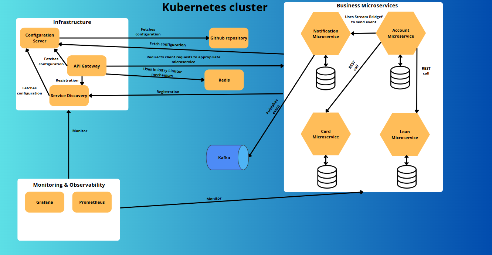

1. [Introduction](#introduction)
2. [Technology stack](#technology-stack)
3. [Architecture overview](#architecture-overview)
4. [Used patterns](#used-patterns)

## Introduction
An example application that simulates a banking system. The main goal of this project was to design a system using a Microservice Architecture style, employing Spring Cloud modules and Kotlin.

## Technology stack
* Kotlin
* Gradle
* Spring Boot
* Spring Cloud
* Spring Security
* Junit
* AssertJ
* Keycloak
* MySQL
* Redis
* Kafka
* Prometheus
* Grafana
* Docker
* Kubernetes
* Helm

## Architecture overview
The application is divided into 7 microservices.

* Account
* Api gateway
* Card
* Config server
* Loan
* Notification
* Service discovery

## Used patterns
* Service discovery
* Config server
* Api gateway
* Circuit breaker
* Retry
* Rate limiter
* Bulkhead
* Load balancer

To increase resiliency, the Api gateway implements:
* Circuit breaker
* Rate limiter
* Retry
* Load balancer

Moreover, Api gateway is responsible for authentication.